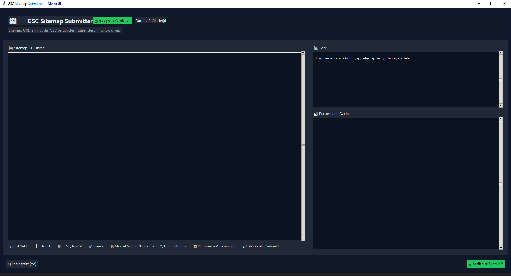

# GSC Sitemap Submitter — Metro UI

Google Search Console'a (GSC) **toplu sitemap bildirme** işlemini tek tıkla yapan, modern Metro temalı bir masaüstü uygulaması.  
Python + Tkinter ile geliştirilmiştir. OAuth ile güvenli giriş yapar, `.txt` içindeki tüm sitemap URL’lerini otomatik olarak GSC’ye gönderir.

---

## 🖼️ Program Ekran Görüntüsü


---

## ✨ ÖZELLİKLER

- 🗂️ **Toplu yükleme:** `.txt` dosyasından sınırsız sitemap URL’i alır  
- 🧠 **Akıllı site tespiti:** `https://alanadiniz.com/sitemap.xml` içinden otomatik olarak `https://alanadiniz.com/` kök URL’sini çıkarır  
- 🔐 **Güvenli OAuth:** `credentials.json` ile Google hesabınızda yetkilendirme  
- 🪟 **Modern Metro UI:** Koyu tema, kart yapısı, responsive düzen  
- 🧾 **Anlık log:** Her adımı canlı olarak görürsünüz (başarılı / hata)  
- ✅ **GSC API v3:** Resmî webmasters API ile uyumlu  
- 💾 **Log kaydet:** Uygulama içindeki log’u tek tuşla `.txt` olarak dışa aktarabilirsiniz  
- 🧰 **Çapraz platform:** Windows ve Linux ile uyumlu  

---

## 🆕 Yeni Eklenen Araç (Tools) Özellikleri

### 📜 Mevcut Sitemap’leri Listele
- GSC’de doğrulanmış tüm siteleri çeker  
- Her site için GSC’de kayıtlı sitemap’leri listeler  
- Bulunan tüm sitemap URL’lerini **listeye otomatik ekler**  
- İşlem sonunda şu uyarı çıkar:  
  > “Toplam X sitemap bulundu ve listeye eklendi.”  
- Eğer path yalnızca `/sitemap.xml` şeklindeyse otomatik olarak tam URL’ye dönüştürür (`https://site.com/sitemap.xml`)

---

### 📤 Listelenenleri Submit Et
- GSC’den çekilen tüm sitemap’leri yeniden GSC’ye gönderir  
- Kaç sitemap gönderileceğini kullanıcıdan onay alır  
- Log’da her adımı gösterir (`✅ Gönderildi` / `❌ Hata`)  
- Tüm sitemap’lerin hızlı şekilde “refresh” edilmesini sağlar  

---

### 🔍 Durum Kontrolü
- Listedeki sitemap’lerin GSC üzerindeki durumunu kontrol eder  
- “pending” mi, “son indirildiği tarih” ne zaman, hata var mı — hepsini log’da gösterir  
- GSC paneline girmeden sitemap durumlarını görmenizi sağlar  

---

### 📊 Performans Verilerini Getir (Search Analytics Özeti)
- GSC’deki doğrulanmış tüm siteler için son **7 günlük performansı** getirir  
- Veriler:  
  - Tıklama  
  - Gösterim  
  - Ortalama CTR  
  - Ortalama Pozisyon  
- Sol listeye site URL’lerini yazar  
- Sağ tarafta “📊 Performans Özeti” panelinde detayları gösterir  

---

### 💾 Log Kaydet (.txt)
- Sağdaki log alanındaki tüm içeriği `.txt` dosyası olarak kaydeder  
- Özellikle çoklu domain yönetiminde hata analizi için kullanışlıdır  

---

## 🧭 KİMLER KULLANMALI?

- 📰 Haber siteleri ve çoklu domain yöneten yayıncılar  
- 🛍️ E-ticaret ve pazaryeri işletmeleri  
- 🧰 SEO ajansları ve uzmanları  
- 🧑‍💻 Web geliştiricileri (deployment sonrası sitemap süreçlerini hızlandırmak için)

---

## 🤔 NEDEN BU ARAÇ?

- ⏱️ Aynı işlemi GSC arayüzünde tek tek yapmak zaman alır  
- 🧩 Tüm sitelerinizi tek pencereden yönetirsiniz  
- 🛡️ OAuth sayesinde hesap güvenliği korunur  
- ✔️ Hata ve başarı log’larını anlık görürsünüz  
- 📊 Artık sitemap yönetimi + performans analizi aynı ekrandan yapılabilir  

---

## 🚀 HIZLI BAŞLANGIÇ

### 1️⃣ Gereksinimler
- Python 3.9+  
- Google Cloud Console erişimi (OAuth oluşturmak için)  
- GSC üzerinde doğrulanmış web siteler  

---

### 2️⃣ Kurulum
```bash
git clone https://github.com/ebubekirbastama/gsc-sitemap-submitter-metro.git
cd gsc-sitemap-submitter-metro

python -m venv .venv
# Windows
.venv\Scripts\activate
# macOS / Linux
source .venv/bin/activate

pip install -r requirements.txt
